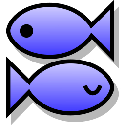

# Kirikiri for Nintendo Switch



This repository contains a Kirikiri-compatible (often mistranslated as Yoshiri Yoshizato) core ported to the Nintendo Switch.  
Kirikiri is almost always exclusively used with [Kirikiri Adventure Game 3 (KAG3)](https://github.com/krkrz/kag3) visual novel engine 
(or its derivitives), but it can also be used for desktop applications and utilities (similar to the use case of [Electron](https://www.electronjs.org/)), such as the [E-mote editor](https://emote.mtwo.co.jp/).  

## Building

After installing the prerequisite libraries using `dkp-pacman`, a simple `make` will generate `krkrs.nro`.  
If you get an "file not found" or "library not found" error while compiling the engine, install the missing library from `dkp-pacman`.

## RomFS Integration

To integrate the game into one single `nro` file, do the following:
* Uncomment line 43 of `Makefile`
* Place game files in a directory named `romfs`
* Rename all files and folders to lowercase
* Build as described in the "Building" section

Please note that if files and folder names are not converted to lowercase, you will get errors when the file is not found.  
Also, please note that if the file name is non-7-bit safe, the file can not be accessed. In that case, please use an XP3 archive.

## Project Directory Selection

If `startup.tjs` exists in RomFS, the project directory and current directory will be set to `romfs:/`. If the aforementioned condition is not met, the project directory will be set to the current directory (usually the same directory as where `krkrs.nro` is located).

## Plugins

External plugin usage is not supported at this time.  
The following internal "plugins" are supported:
* [csvParser](https://github.com/wtnbgo/csvParser)
* dirlist
* [fftgraph](https://github.com/krkrz/fftgraph)
* [getSample](https://github.com/wtnbgo/getSample)
* layerExPerspective
* [saveStruct](https://github.com/wtnbgo/saveStruct)
* [varfile](https://github.com/wtnbgo/varfile)
* [win32dialog](https://github.com/wtnbgo/win32dialog)
* wutcwf

In order to use the functionality of the internal plugins, `Plugins.link` needs to be called with the name of the plugin. Example:
```js
Plugins.link("csvParser.dll");
```
After that is done, the functionality of the plugin can be used:
```js
var x = new CSVParser();
```

## Fonts

In order to use a font, it must be added using `Font.addFont`.
Example usage:
```js
Font.addFont("fonts/meiryo.ttf");
```

## Text File Encoding

UTF-16LE encoding with BOM is preferred, as it can be streamed in without any re-encoding or decompression.  
Here are the rules for encoding detection:  
If the first bytes are 0xfe 0xfe, the file will be decoded/deobfuscated and the encoding detection will continue.  
If the first bytes are 0xff 0xfe (UTF-16LE BOM), the file is loaded as UTF-16LE.  
If the first bytes are 0xef 0xbb 0xbf (UTF-8 BOM), the file is loaded as UTF-8.  
Otherwise, the encoding is set using the `-readencoding` command line option.  
If TVP_TEXT_READ_ANSI_MBCS is defined, the default value will be Shift_JIS.  
Otherwise, it will be UTF-8. Valid options are: `""`, `"UTF-8"`, `"Shift_JIS"`, `"GBK"`.  
If the option is `""`, the decoding will be attempted in the following order: `"Shift_JIS"`, `"UTF-8"`, `"GBK"`.  
If decoding fails, `TJSNarrowToWideConversionError` will be thrown.  

## Archive support

The only archives supported using this engine are unencrypted XP3 archive.  
The archive can reside on the SD card filesystem or in RomFS.  
Using an archive can alleviate the issue with file name encoding and file name case.  
The archive can be accessed using the archive delimiter (default is `>`, and can be set with `-arcdelim` command line argument).  
Example usage:  
```js
Scripts.execStorage("archive.xp3>file.tjs");
```

## 3rd Party Project Usage

Code from the following projects was used:
* [libnx](https://github.com/switchbrew/libnx)
* [ffmpeg](http://ffmpeg.org/)
* [zlib](https://www.zlib.net/)
* [libpng](http://www.libpng.org/)
* [libjpeg-turbo](https://libjpeg-turbo.org/)
* [libwebp](https://developers.google.com/speed/webp/download)
* [libass](https://github.com/libass/libass)
* [fribidi](http://fribidi.org/)
* [Opus](http://opus-codec.org/)
* [Vorbis](https://xiph.org/vorbis/)
* [Simple DirectMedia Layer (SDL) 2](https://www.libsdl.org/)
* [Freetype](https://www.freetype.org/)
* [Oniguruma](https://github.com/kkos/oniguruma)
* [bzip2](https://www.sourceware.org/bzip2/)
* [A C-program for MT19937](http://www.math.sci.hiroshima-u.ac.jp/~m-mat/MT/VERSIONS/C-LANG/mt19937-64.c)
* [Kirikiri 2](https://github.com/krkrz/krkr2)
* [Kirikiri Z](http://krkrz.github.io/)
* [Kirikiroid2](https://github.com/zeas2/Kirikiroid2)
* [mkrkr](https://github.com/zhangguof/mkrkr)
* [Kirikiri SDL2](https://github.com/uyjulian/krkrsdl2)

## License

This project is licensed under a modified BSD license. Please read the `LICENSE` file for more information.  
Multiple third party projects are used. Please read the `LICENSE.3rdparty` file for more information.
